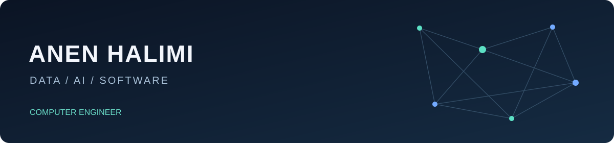

# Anen HALIMI

**Computer Engineer · Data & AI**

English · [Français](README.fr.md)

I build Python applications around computer vision, data processing and machine learning. My interests connect AI models with the software and infrastructure needed to use them: camera pipelines, document automation, interfaces and distributed computing.

**I am looking for Data and AI engineering opportunities across France.** My background also includes embedded systems, cloud and software development.

## Selected public projects

| Project | Problem addressed | Technical focus |
|---|---|---|
| [OpenSpace People Counter](https://github.com/anen-halimi/openspace-people-counter) | Turn camera streams into entry, exit and occupancy counts | Python, YOLO, OpenCV, tracking, CPU/GPU execution |
| [Bordereaux](https://github.com/anen-halimi/Bordereaux) | Transform technical PDFs into structured Excel reports | OCR, pandas, Flask, batch processing |
| [Passenger Detection](https://github.com/anen-halimi/Comptage_Passagers) | Explore detection and duplicate suppression across camera views | YOLO, calibration, homography, image analysis |
| [Video Style Transfer](https://github.com/anen-halimi/Transfert-de-Style) | Explore text-guided changes to video appearance | PyTorch, diffusion models, TokenFlow application |

Each repository explains its purpose, entry points and current limitations in English and French. Research implementations and third-party methods are credited in the project documentation.

## Technical interests

**Data & AI** — Python, PyTorch, computer vision, detection, segmentation, tracking and generative models.

**Data processing & applications** — pandas, OCR, document workflows, Flask and desktop interfaces.

**Systems & infrastructure** — Linux, Docker, CUDA, distributed training and model integration, alongside an interest in embedded systems and cloud.

## What I want to work on

Engineering roles where I can develop useful data and AI applications, connect models to real inputs and users, and improve how those systems are tested, operated and maintained.

**Open to opportunities throughout France.**

